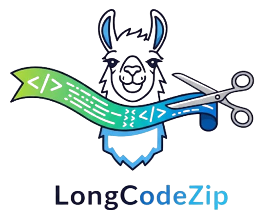
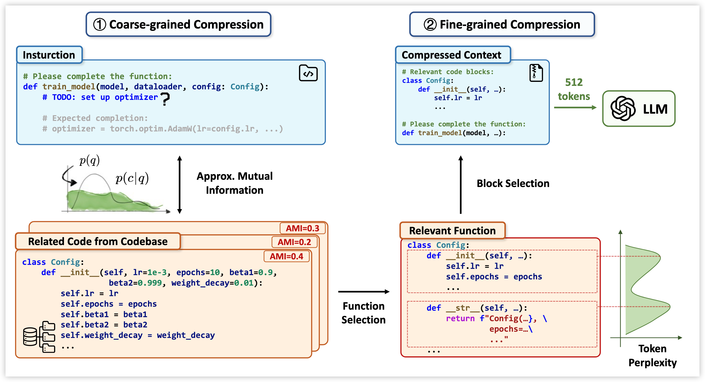

<div align="center">
  

[](https://arxiv.org/abs/2510.00446) [](https://conf.researchr.org/details/ase-2025/ase-2025-papers/121/LongCodeZip-Compress-Long-Context-for-Code-Language-Models) [](https://www.python.org/downloads/release/python-397/) [](https://github.com/YerbaPage/LongCodeZip) [](LICENSE)

</div>

# LongCodeZip

This repository is the official implementation of LongCodeZip, a novel two-stage long code compression method. Our paper "LongCodeZip: Compress Long Context for Code Language Models" has been accepted to **ASE 2025**.

## Method Overview



LongCodeZip introduces a two-stage code compression framework specifically designed for code LLMs:

1. **Coarse-grained Compression**: Function-based chunking and ranking using conditional perplexity with respect to the query to select the most relevant functions.

2. **Fine-grained Compression**: Entropy-based block detection combined with 0/1 knapsack optimization to maximize relevance within adaptive token budgets.

The method is plug-and-play and can be integrated with existing code LLMs to achieve significant compression ratios while maintaining or improving task performance.

## Installation

You can install directly from the GitHub repository:

```bash
pip install git+https://github.com/YerbaPage/LongCodeZip.git
```

Or clone and install in development mode:

```bash
git clone https://github.com/YerbaPage/LongCodeZip.git
cd LongCodeZip
pip install -e .
```

## Quick Demo

We provide a simple demo (`demo.py`) to help you get started with LongCodeZip. 

```bash
python demo.py
```

The demo showcases both compression modes: coarse-grained compression (function-level selection only) and the full two-stage compression (with fine-grained token optimization). It demonstrates how LongCodeZip compresses a code file based on a given query and achieves different compression ratios.

After compression, the demo uses `Qwen/Qwen2.5-Coder-7B-Instruct` as the default generation model.  
You can change this by specifying `--generation_model`.

To use an OpenAI API instead of an open source model, add the `--use_openai` flag. 

**Example:**
```bash
python demo.py --use_openai --generation_model gpt-4o
```
It is recommended to set your API key as an environment variable. For example, create a `.env` file and add: `OPENAI_API_KEY="enter_ your_key_here"`

## Basic Example

```python
from longcodezip import LongCodeZip

# Initialize the compressor
compressor = LongCodeZip(model_name="Qwen/Qwen2.5-Coder-7B-Instruct")

# Compress code with a query
result = compressor.compress_code_file(
    code=<your_code_string>,
    query=<your_query>,
    instruction=<your_instruction>,
    rate=0.5,  # Keep 50% of tokens
    rank_only=False, # Set to True to only rank and select contexts without fine-grained compression
)

# Access compressed results
compressed_code = result['compressed_code']
compressed_prompt = result['compressed_prompt']  # Full prompt with instruction
compression_ratio = result['compression_ratio']
```

## References

```bibtex
@article{shi2025longcodezip,
  title={LongCodeZip: Compress Long Context for Code Language Models},
  author={Shi, Yuling and Qian, Yichun and Zhang, Hongyu and Shen, Beijun and Gu, Xiaodong},
  journal={arXiv preprint arXiv:2510.00446},
  year={2025}
}
```
